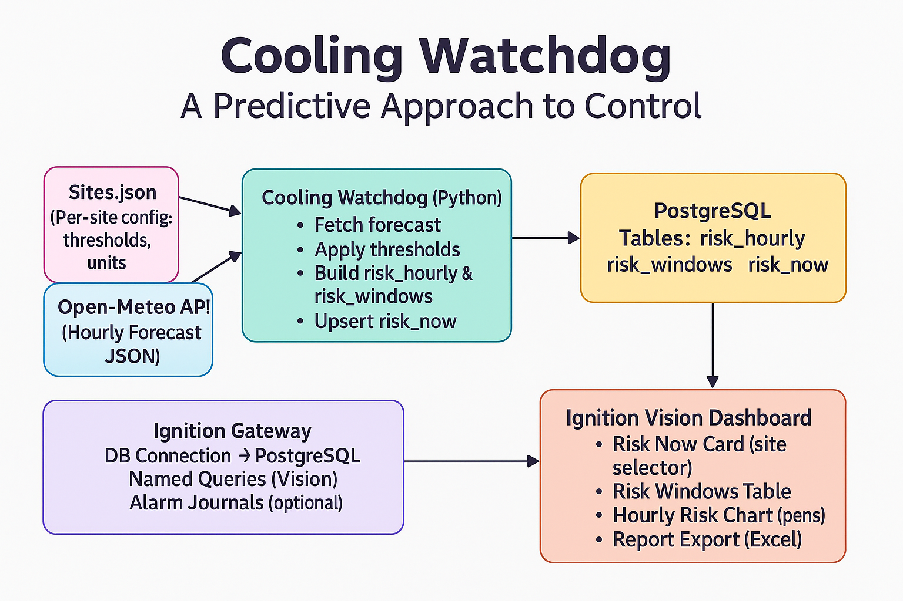
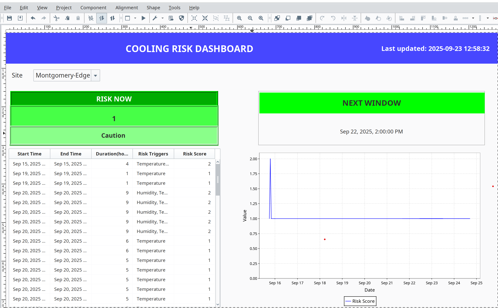

# Cooling Watchdog 🌡️🌀  

**A proactive weather-driven risk detection service for data center cooling systems.**  
Continuously monitors weather forecasts, evaluates against custom thresholds, and surfaces upcoming **risk windows** to operators via **Ignition SCADA** (SQL integration) and **Cloud MQTT brokers** (e.g., Azure IoT Hub, EMQX, HiveMQ).  

---

## ⚡ Motivation  

Cooling systems in data centers are typically controlled by **reactive, rule-based strategies**.  
- If temperature rises above a setpoint → dampers open, chillers stage up, valves open.  
- If humidity drops below a threshold → humidifiers engage.  
- If wind increases → economizers close.  

While effective at preventing immediate failure, this **reactive approach** has major drawbacks:  

- ⚡ **Abrupt responses** — sudden staging of chillers, rapid valve/damper movements.  
- 💸 **Energy inefficiency** — large spikes in energy consumption from quick reactions.  
- 🛠️ **Mechanical stress** — equipment endures unnecessary wear due to abrupt load changes.  

### The Gap
Operators today often **lack visibility** into upcoming weather-driven stress. Control systems only act **after** thresholds are violated. By that time, the BMS/SCADA is forced into abrupt, energy-intensive actions.  

### Why Cooling Watchdog
Cooling Watchdog introduces **forecast-based awareness** into the data center. By monitoring external weather and predicting risk windows:  
- Operators gain **advance visibility** into upcoming stress events (heat spikes, low humidity, high winds).  
- With this insight, they can **proactively adjust setpoints** (e.g., lower supply air temp, pre-stage chilled water) ahead of the event.  
- This enables a **gradual and measured response** instead of abrupt rule-based reactions.  

✅ Benefits:  
- **Improved energy efficiency** — smoother transitions reduce energy spikes.  
- **Lower mechanical stress** — valves, dampers, and chillers operate more gradually.  
- **Enhanced resiliency** — operators are prepared, not surprised.  

Cooling Watchdog bridges the gap between **raw forecasts** and **operator action**, turning SCADA from reactive alarms into **proactive intelligence**.  

---

## 💡 Solution Overview  

Cooling Watchdog is a Python-based service that:  

1. **Fetches weather forecasts**  
   - Uses the free [Open-Meteo API](https://open-meteo.com/) (no API key required).  
   - Supports multiple sites, defined in `Sites.json`.  

2. **Evaluates risk thresholds**  
   - Configurable per-site:  
     - Temperature ≥ `max_temp_c`  
     - Wind speed ≥ `max_wind_mps`  
     - Relative humidity ≤ `min_relative_humidity_pct`  
   - Slices only the next **N hours** (`horizon_hours` from config).  

3. **Detects and merges risk windows**  
   - Groups consecutive risky hours into windows.  
   - Applies a **1-hour grace period** between windows.  

4. **Outputs results in multiple formats**  
   - **SQL tables** (`risk_now`, `risk_windows`) for SCADA dashboards.  
   - **MQTT messages** for cloud brokers (Azure IoT Hub, EMQX, HiveMQ). 
   - **Excel reports** (auto-generated, timestamped) summarizing site risk windows.  
   - **JSON + Markdown reports** for operators.  

✅ This makes SCADA **proactive** instead of reactive.  

---

## System Architecture

## 📊 Example Excel Report

Cooling Watchdog generates Excel risk reports under the `reports/` folder.  
Each report includes hourly forecasts, risk flags, and summarized risk windows.

Example report:  
[Cooling_Watchdog_Risk_Report_20250909_2153.xlsx](reports/Cooling_Watchdog_Risk_Report_20250909_2153.xlsx)

## 📂 Project Structure  

---

## 📊 Ignition Vision Dashboard

The **Cooling Risk Dashboard** has been implemented in Ignition Vision to visualize the data stored in the
`risk_now`, `risk_windows`, and `risk_hourly` tables.

### Dashboard Features

- **Risk Now Card** → Displays the current site risk score and whether conditions are safe or at risk.
- **Next Window Card** → Shows the upcoming risk window start time and countdown in hours.
- **Risk Windows Table** → Tabular view of upcoming risk events with start time, end time, duration, triggers, and risk score.
- **Risk Hourly Timeline (Easy Chart)** → Graphs the hourly risk score for the selected site. Users can hardcode time ranges (e.g., `2025-09-01` to `2025-09-02`) or configure dynamic ranges.

### Example Screenshot

### Notes

- Dropdown allows site selection (`Virginia-East`, `Montgomery-Edge`, etc.).
- Named Queries (`getRiskNow`, `getWindows`, `getHourlySeries`) drive all data cards and tables.
- The Easy Chart is bound to the `risk_hourly` table for timeline visualization.

---

## 🌡️ Cooling Risk Dashboard in Ignition Vision

We designed and implemented a **Cooling Risk Dashboard** in Ignition Vision that visualizes data stored in PostgreSQL (`risk_now`, `risk_windows`, `risk_hourly`).

### Dashboard Features
- **Site Selector** – Dropdown list dynamically populated from distinct sites across all risk tables.
- **Risk Now Card** – Shows the current `risk_score` with severity color coding (Safe, Caution, Warning, Critical).
- **Next Window Card** – Displays the timestamp of the next projected risk window and countdown in hours.
- **Risk Windows Table** – Tabular view of all upcoming windows with start time, end time, duration, triggers, and risk score.
- **Risk Hourly Timeline (Easy Chart)** – Time-series chart plotting hourly `risk_score` trends for the selected site.

### Dashboard Screenshot

### Implementation Notes
- Named Queries in Ignition: `getRiskNow`, `getWindows`, `getHourlySeries`, `Sites`.
- Queries filter data based on the `:site` parameter bound to the dropdown.
- Risk Score styling is applied in Vision Tables using `configureCell` for dynamic cell coloring.

---
